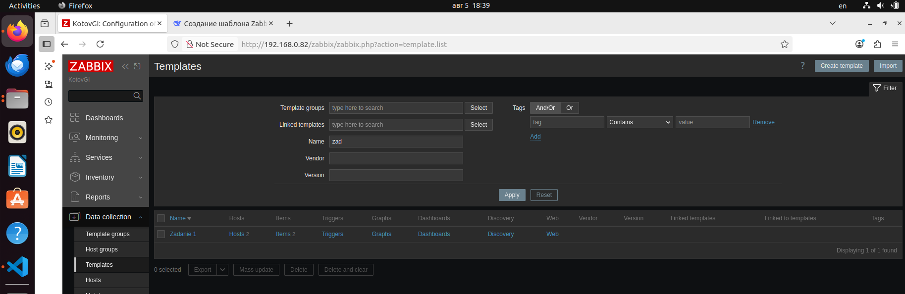
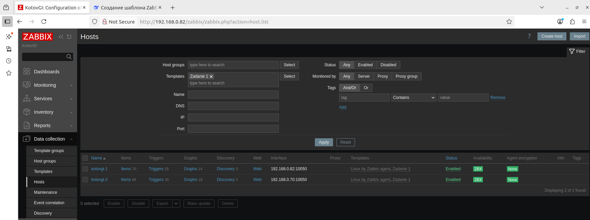
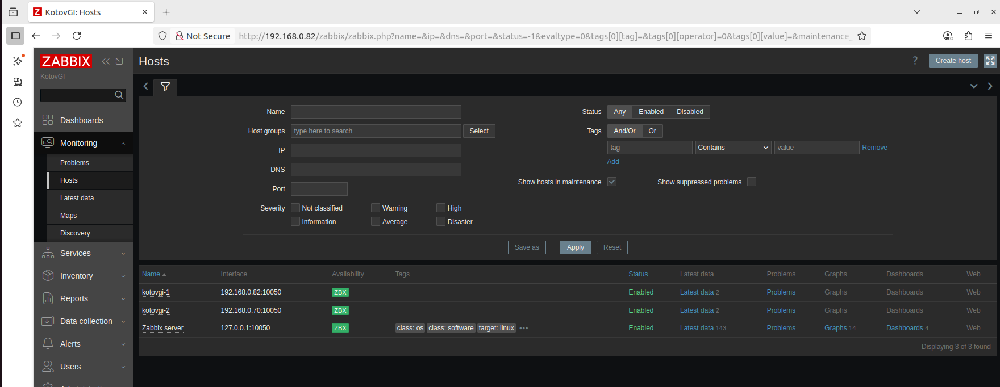
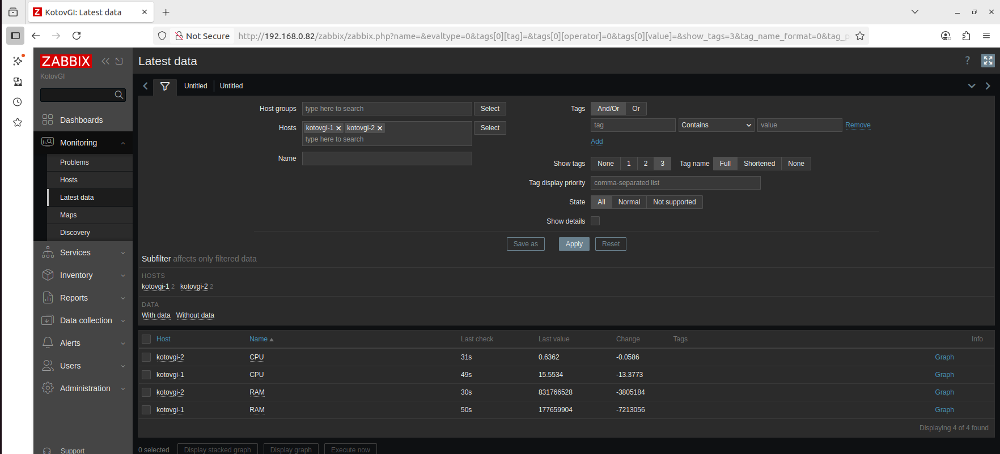

# Домашнее задание к занятию "Система мониторинга Zabbix" - Котов Г.И.


### Задание 1
Установите Zabbix Server с веб-интерфейсом.
#### Процесс выполнения:
1. Выполняя ДЗ, сверяйтесь с процессом отражённым в записи лекции.
2. Установите PostgreSQL. Для установки достаточна та версия, что есть в системном репозитороии Debian 11.
3. Пользуясь конфигуратором команд с официального сайта, составьте набор команд для установки последней версии Zabbix с поддержкой PostgreSQL и Apache.
4. Выполните все необходимые команды для установки Zabbix Server и Zabbix Web Server.

#### Требования к результатам:
1. Прикрепите в файл README.md скриншот авторизации в админке.
2. Приложите в файл README.md текст использованных команд в GitHub.

### Решение: 
1. Скриншот авторизации:




```
2. Текст использованных команд в GitHub:
git status
git add .
git commit -m "test5"
git push origin main
```
---

### Задание 2

Установите Zabbix Agent на два хоста.
#### Процесс выполнения:
1. Выполняя ДЗ, сверяйтесь с процессом отражённым в записи лекции.
2. Выполняя ДЗ, сверяйтесь с процессом отражённым в записи лекции.
3. Установите Zabbix Agent на 2 вирт.машины, одной из них может быть ваш Zabbix Server.
4. Добавьте Zabbix Server в список разрешенных серверов ваших Zabbix Agentов.
5. Добавьте Zabbix Agentов в раздел Configuration > Hosts вашего Zabbix Servera.
6. Проверьте, что в разделе Latest Data начали появляться данные с добавленных агентов.

#### Требования к результатам:
1. Приложите в файл README.md скриншот раздела Configuration > Hosts, где видно, что агенты подключены к серверу
2. Приложите в файл README.md скриншот лога zabbix agent, где видно, что он работает с сервером
3. Приложите в файл README.md скриншот раздела Monitoring > Latest data для обоих хостов, где видны поступающие от агентов данные.
4. Приложите в файл README.md текст использованных команд в GitHub

### Решение: 
1. скриншот раздела Configuration > Hosts:

`

2. Поскольку на ноутбуке (№1) я не смог запустить одновременно две ВМ. Для выполнения задания воспользовался вторым стареньким ноутбуком (№2). 

скриншот лога zabbix agent на ноутбуке №1 ВМ:



скриншот лога zabbix agent на ноутбуке №2: 




3. скриншот раздела Monitoring > Latest data для обоих хостов:


```
Текст использованных команд в GitHub:
git status
git add .
git commit -m "test5"
git push origin main
```
---
